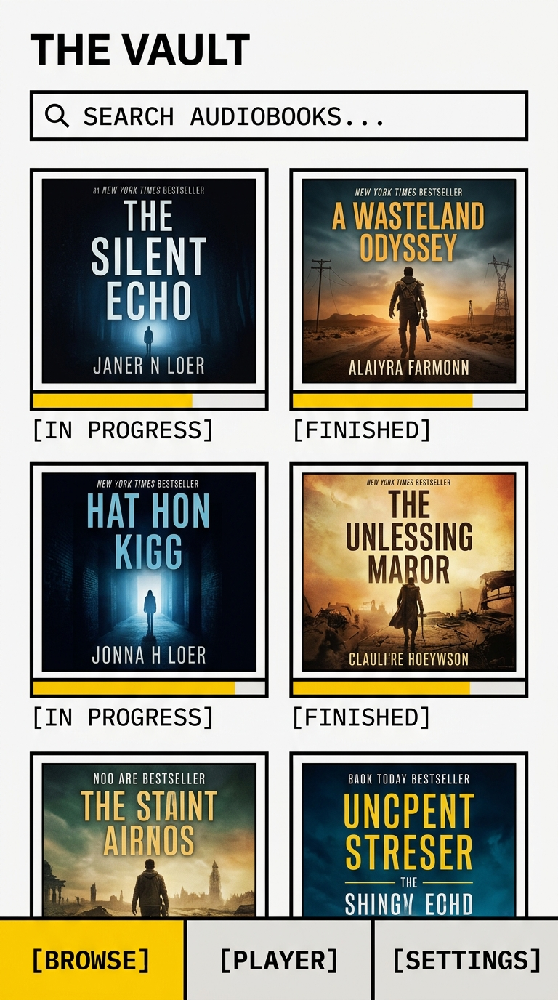
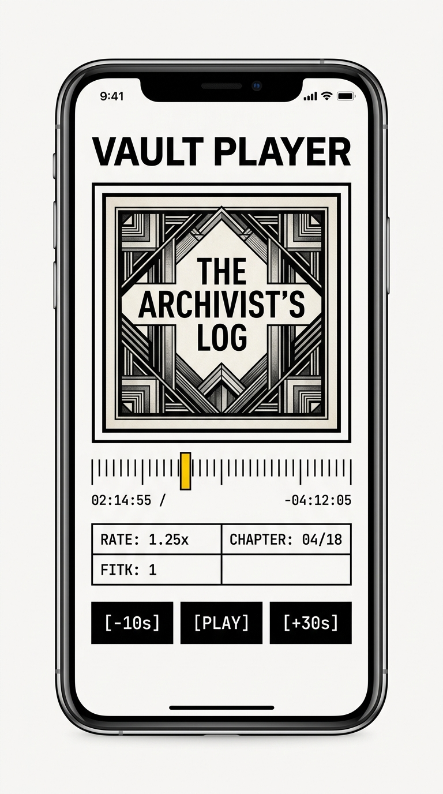
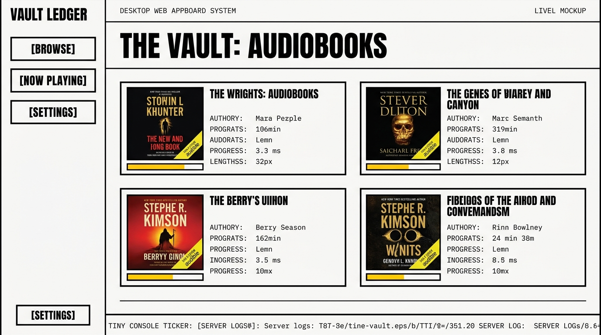

#  ListenShelf

**ListenShelf** is a premium, self-hosted audiobook client application built with React Native and Expo. It interfaces seamlessly with your personal **Audiobookshelf** server, featuring a highly-stylized, high-contrast **Neobrutalist Vault Ledger** aesthetic. 

Designed for both streaming and offline environments, the client provides robust offline sequence-caching, native background audio drivers, and automated APK build workflows.

---

## 📸 App Functionalities & Screenshots

### 📚 Catalog Browse Shelf
Browse your entire Audiobookshelf library in a striking 2-column neobrutalist catalog layout. Easily filter by library type, search books, and check download status.
<p align="center">
  
</p>

### 🎧 Main Playback Console & Chapter Index
Control your audiobook playback with a native sound engine. Supports segmented multi-step skip panels (`+/-10s`, `+/-30s`, `+/-60s`), playback speed scaling (`0.80x` to `1.20x`), sleep timers, and a tabular interactive chapter grid.
<p align="center">
  
</p>

### 🛠️ Admin Panel & Configuration Dashboard
Monitor server connections, sync offline progress, register user profiles, and switch between four distinct visual themes on the fly.
<p align="center">
  
</p>

---

## 🚀 Core Features

*   **Four Visual Skins:** Switch styles instantly in the settings menu:
    *   **Ledger:** Institutional off-white console.
    *   **Terminal:** Retro cyberpunk command line.
    *   **Classified:** Folder index stamp card look.
    *   **Blueprint:** Structural engineering grid lines.
*   **Offline Caching Engine:** Downloads audiobook covers, sequential audio tracks, and chapter layouts directly to the native phone memory using `expo-file-system/legacy`. Fully functional when disconnected from Wi-Fi/Internet.
*   **Offline Progress Syncing:** Caches reading progress locally while offline and automatically updates your main Audiobookshelf server progress when reconnecting.
*   **Global Play/Pause Overlay:** A floating neobrutalist playback strip sits directly above the bottom tab bar. Start, pause, or view current book titles from any screen without switching tabs.
*   **Advanced Player Controls:** Features micro-adjusted speed modifiers, sleep timers (countdown or end-of-chapter triggers), and precise native chapter seeking.

---

## 🛠️ Getting Started & Dev Setup

### Prerequisites
*   Node.js (v20 or higher recommended)
*   Expo Go app installed on your physical Android/iOS phone

### Installation
1. Clone the repository:
   ```bash
   git clone https://github.com/Kimishiba/ListenShelf.git
   cd ListenShelf
   ```
2. Install npm dependencies:
   ```bash
   npm install
   ```
3. Start the Metro bundle server:
   ```bash
   npx expo start
   ```
4. Open the Expo Go app on your phone, scan the QR code from the terminal, and start listening!

---

## 📦 Compiling standalone APKs

This project comes pre-configured with **EAS Build** and **GitHub Actions** for automated APK compilation.

### Automatic Cloud Builds (CI/CD)
Whenever you push a commit to the `main` branch, a GitHub Action automatically triggers a compilation in the cloud.
1. Add your Expo Access Token (`EXPO_TOKEN`) to your GitHub repository secrets.
2. Push your changes.
3. Access the completed APK from your **[Expo Dashboard](https://expo.dev)**.

### Manual Local Builds
To trigger a build manually from your Mac terminal:
```bash
npx eas-cli build --platform android --profile preview
```
This uploads the Javascript bundle and downloads a sideloadable `.apk` file when compilation concludes.
